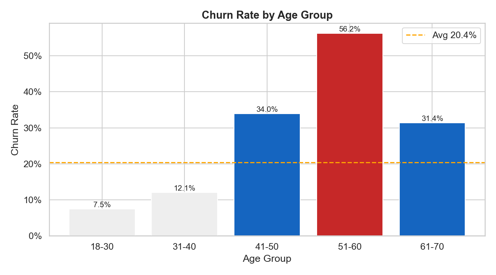
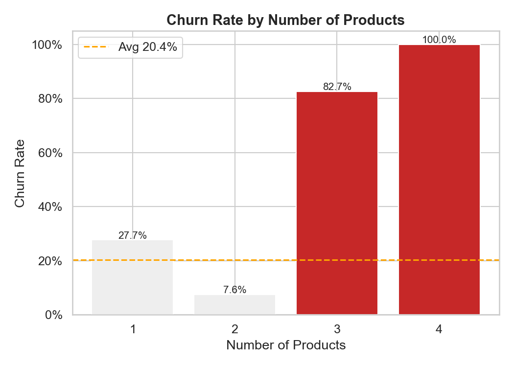
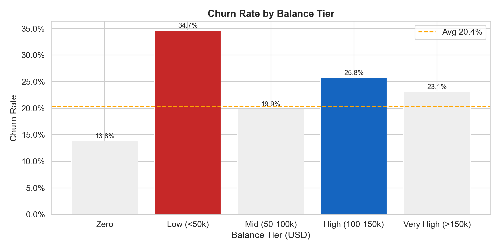
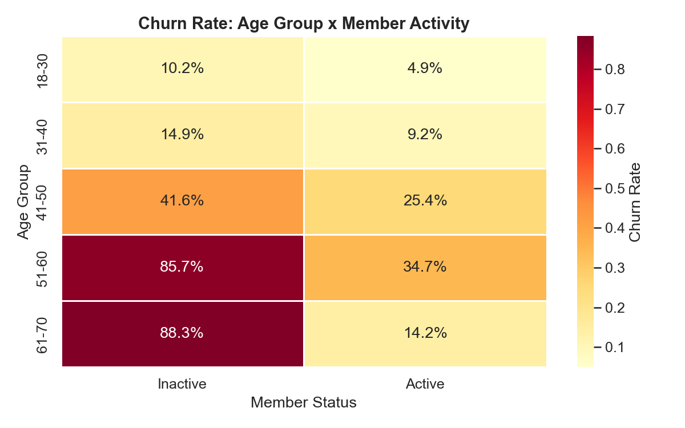
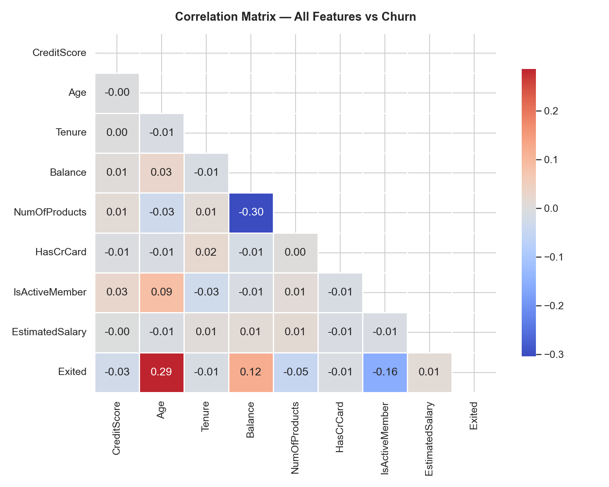

# Customer Churn Analysis — Fintech Retention Strategy

**Role:** Business Analyst / Data Analyst  
**Domain:** Fintech · Digital Banking · Customer Retention  
**Stack:** Python · SQL · Looker Studio · Excel  
**Dataset:** [Bank Customer Churn — Kaggle](https://www.kaggle.com/datasets/shrutimechlearn/churn-modelling) (10,000 records)

---

## Problem Statement

A fictional retail bank is experiencing high customer churn (20.4% overall). As the Business Analyst, I was tasked with identifying key churn drivers from historical customer data and translating findings into structured retention recommendations for the product and marketing teams.

---

## What I Did

| Step | Activity | Output |
|------|----------|--------|
| 1 | Exploratory Data Analysis in Python | 9 charts across all key dimensions |
| 2 | Advanced SQL queries (Window Functions, CTEs) | Cohort segmentation, risk scoring |
| 3 | Looker Studio dashboard | KPI card, bar charts, geo breakdown |
| 4 | BA Recommendations report | 6 findings, structured recommendations |

---

## Key Findings (verified against data)

| Finding | Churn Rate | vs Average |
|---------|-----------|------------|
| Customers with 3+ products | 85.9% | +65.5pp |
| Age group 51–60 | 56.2% | +35.8pp |
| Age group 41–50 | 34.0% | +13.6pp |
| Low balance customers (<$50k) | 34.7% | +14.3pp |
| Germany segment | 32.4% | +12.0pp |
| Female customers | 25.1% | +4.7pp |
| Inactive members | 26.9% | +6.5pp |
| Overall average | 20.4% | — |

**Notable:** Churned customers hold avg balance of $91,109 vs $72,745 for retained — a 25% gap.

---

## BA Recommendations

1. **Product audit** — investigate over-selling to 3+ product customers (85.9% churn, 326 customers)
2. **Retention campaign** — target age 51–60 via preferred channel, not just app push
3. **Re-engagement program** — flag inactive members at 60-day mark for proactive outreach
4. **Germany audit** — country-level investigation before applying global retention campaign
5. **High-value tier** — premium service tier for high-balance customers showing churn signals
6. **Gender gap investigation** — exit survey and product usage audit by gender

---

## Repository Structure

```
ba-fintech-churn-analysis/
├── 01-data/              # Raw dataset (10,000 records) + data dictionary
├── 02-python/            # EDA scripts (pandas, seaborn, matplotlib) + requirements.txt
├── 03-sql/               # 6 SQL queries (overview → cohort → window functions)
├── 04-powerbi/           # Looker Studio dashboard PDF
├── 05-insights/          # 9 charts + BA Recommendations report (bilingual)
└── 06-presentation/      # Executive summary dashboard
```

---

## Key Visualizations

### Churn by Age Group


### Churn by Number of Products


### Churn by Balance Tier


### Age × Activity Heatmap


### Correlation Matrix


---

## Skills Demonstrated

`Requirements Analysis` `Data-driven Decision Making` `SQL Window Functions`  
`Python EDA` `Looker Studio` `Stakeholder Communication` `Fintech Domain`  
`Hypothesis Testing` `BA Recommendations`

---

*Project by Nguyen Le Bao Dang — Business Analyst*  
*[LinkedIn](https://www.linkedin.com/in/nguyenlebaodang/) · Portfolio: coming soon*